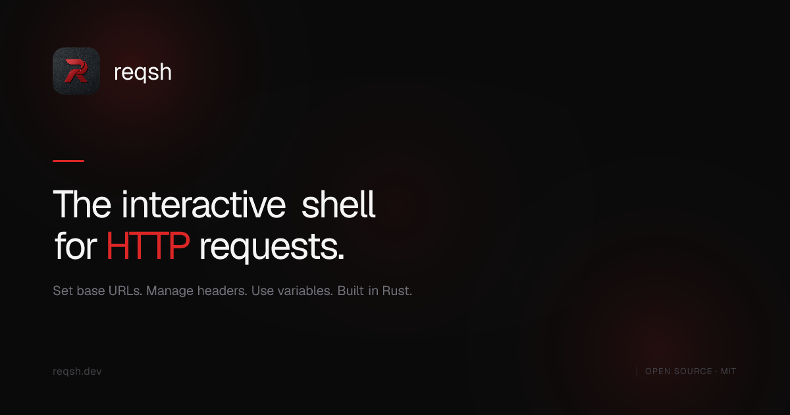

[](#)
[](https://www.rust-lang.org)
[](LICENSE)
[]()
[](http://makeapullrequest.com)

Interactive HTTP shell for API workflows. Send requests, manage headers & variables and rerun past commands from a terminal REPL.

## Features

- Interactive REPL with tab completion
- Send GET, POST, PUT, PATCH, DELETE, HEAD, OPTIONS requests (case-insensitive)
- Multi-line request input for headers and body
- Persistent session state across restarts
- Variable interpolation with `{{name}}` syntax
- Query parameter support with `param: key=value`
- Save, manage and run requests in-session
- JSON response pretty-printing with colored output
- Command history and rerun by index
- Configurable request timeout

## Quick Start

### Install

```bash
curl -fsSL https://reqsh.dev/install.sh | sh
```

Or download a binary from the [releases page](https://github.com/hars-21/reqsh/releases/latest) or [build from source](docs/install.md).

### Usage

```bash
reqsh> base https://api.example.com
reqsh> GET /users
reqsh> POST /users
.....> Content-Type: application/json
.....>
.....> {"name": "john"}
.....> ::send
```

For full documentation on commands, variables and usage see the [docs](docs/introduction.md).

## Contributing

Contributions are welcome. Please read [CONTRIBUTING.md](CONTRIBUTING.md) for guidelines.

## License

MIT. See [LICENSE](LICENSE) for details.
